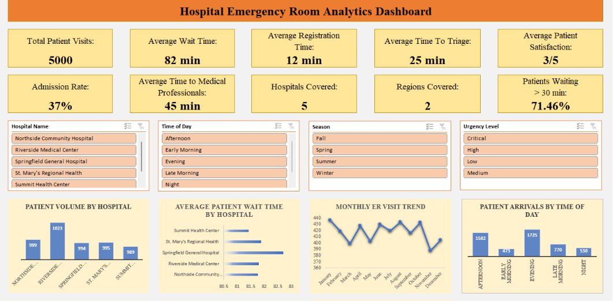
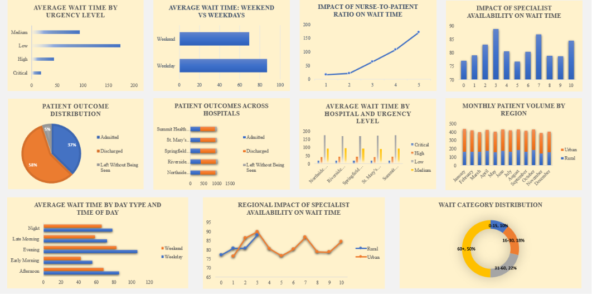
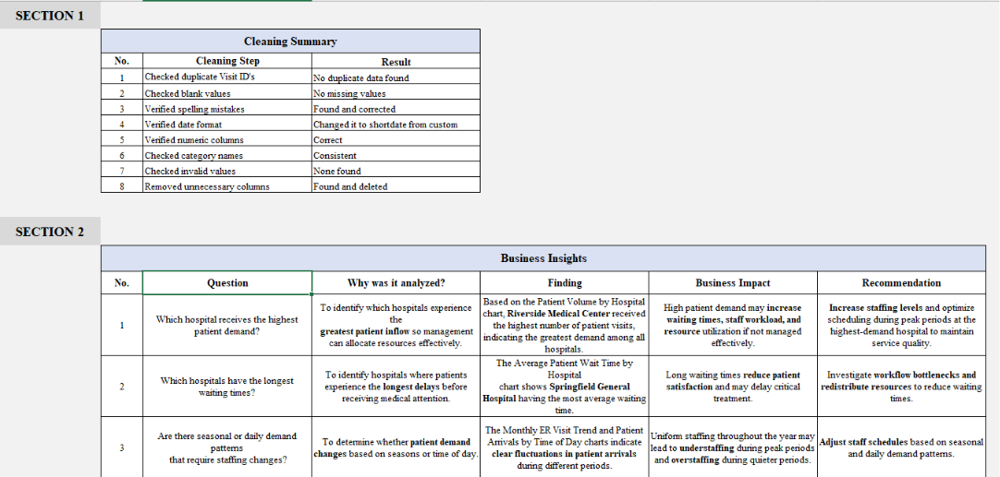

# Hospital-Emergency-Room-Analytics-Dashboard
An interactive Microsoft Excel dashboard developed to analyze hospital emergency room operations using 5,000 patient visit records. This project transforms raw emergency room data into meaningful business insights through data cleaning, PivotTables, KPIs, interactive slicers, and dynamic visualizations to support operational decision-making.

# 📌 Project Overview
- Hospital emergency departments face challenges in managing patient demand, reducing waiting times, improving operational efficiency, and maintaining patient satisfaction.
- This project analyzes emergency room performance across multiple hospitals by identifying patient arrival patterns, waiting time trends, staffing impacts, patient outcomes, and regional performance using Microsoft Excel.
- The dashboard enables users to filter the entire analysis dynamically using slicers, allowing hospital management to explore performance across different hospitals, urgency levels, seasons, and times of day.

# 🎯 Project Objectives
The dashboard was built to answer the following business questions:
1. Which hospital receives the highest patient demand?
2. Which hospitals have the longest waiting times?
3. Are there seasonal or daily demand patterns that require staffing changes?
4. What is the most common patient outcome?
5. Are critical patients receiving timely treatment?
6. Does nurse staffing reduce waiting time?
7. Does specialist availability improve operational efficiency?
8. Are patients being treated within acceptable waiting time targets?
9. Do weekends create longer waiting times?
10. Which hospitals or regions should management prioritize for improvement?

# 📊 Dashboard KPIs
The dashboard summarizes the overall emergency room performance using the following Key Performance Indicators:
## KPI -- Value
Total Patient Visits -- 5,000 
Average Wait Time -- 82 min 
Average Registration Time -- 12 min 
Average Time to Triage -- 25 min
Average Time to Medical Professionals -- 45 min 
Admission Rate -- 37% 
Average Patient Satisfaction -- 3 / 5 
Hospitals Covered -- 5 
Regions Covered -- 2 
Patients Waiting >30 Minutes -- 71.46% 

# 📈 Dashboard Features
The interactive dashboard includes:
- KPI Cards
- Dynamic Slicers
- 15 PivotTables
- 15 Pivot Charts
- Cleaning Summary
- Business Insights
- Overall Conclusion
Interactive slicers allow users to filter the dashboard by:
- Hospital Name
- Time of Day
- Season
- Urgency Level

# 📉 Visualizations Included
## Patient Demand
- Patient Volume by Hospital
- Monthly ER Visit Trend
- Patient Arrivals by Time of Day
## Waiting Time Analysis
- Average Patient Wait Time by Hospital
- Average Wait Time by Urgency Level
- Average Wait Time: Weekend vs Weekdays
- Average Wait Time by Hospital and Urgency Level
- Average Wait Time by Day Type and Time of Day
- Wait Category Distribution
## Staffing Analysis
- Impact of Nurse-to-Patient Ratio on Wait Time
- Impact of Specialist Availability on Wait Time
- Regional Impact of Specialist Availability on Wait Time
## Patient Outcome Analysis
- Patient Outcome Distribution
- Patient Outcomes Across Hospitals
## Regional Analysis
- Monthly Patient Volume by Region

# 📷 Dashboard Preview

## Dashboard Visualizations

### Business Insights Sheet

# 🔍 Key Business Insights
## Highest Patient Demand
Riverside Medical Center recorded the highest patient volume among all hospitals, indicating the greatest demand for emergency services.
## Waiting Time Analysis
Springfield General Hospital recorded the highest average waiting time, suggesting opportunities to improve patient flow and operational efficiency.
## Patient Arrival Patterns
Patient arrivals fluctuate across months and times of day, indicating that staffing requirements should be adjusted based on demand patterns rather than remaining constant throughout the year.
## Patient Outcomes
Most emergency room visits resulted in patient discharge, while only a small proportion of patients left without being seen.
## Urgency Level Performance
Critical patients generally received faster treatment compared to lower-priority cases, indicating effective emergency triage prioritization.
## Staffing Impact
The analysis shows that nurse-to-patient ratio influences waiting time, highlighting the importance of maintaining adequate staffing during busy periods.
## Specialist Availability
Higher specialist availability is associated with improved operational efficiency and reduced waiting times.
## Waiting Time Targets
A significant proportion of patients waited more than 30 minutes before treatment, indicating opportunities to improve operational performance.
## Weekday vs Weekend Performance
Average waiting times differ between weekdays and weekends, suggesting staffing schedules should be optimized based on demand.
## Regional Performance
Regional comparisons help identify hospitals requiring operational improvements and better resource allocation.

# 🧹 Data Cleaning Performed
The following preprocessing steps were completed before analysis:
- Checked duplicate Visit IDs
- Checked missing values
- Corrected spelling inconsistencies
- Standardized date format
- Verified numeric columns
- Standardized category values
- Checked invalid values
- Removed unnecessary columns

# 🛠 Tools used in Microsoft Excel
- PivotTables
- Pivot Charts
- KPI Cards
- Slicers
- COUNTIF
- COUNTA
- AVERAGE

# 🚀 Skills Demonstrated
- Data Cleaning
- Data Transformation
- Conditional Formatting
- Exploratory Data Analysis
- KPI Development
- Interactive Dashboard Design
- Business Intelligence Reporting
- Healthcare Data Analytics
- Excel Visualization
- Data Storytelling
- Business Insight Generation

# 📌 Overall Conclusion
This dashboard provides a comprehensive overview of emergency room operations by combining interactive visualizations, KPI monitoring, and business insights. It highlights patient demand patterns, waiting time trends, staffing impacts, patient outcomes, and regional performance to support data-driven operational decisions.

# 👩‍💻 Author
**Sakshi Mukherjee**
Aspiring Data Analyst | Excel | SQL | Python | Tableau

GitHub: https://github.com/Mukherjee28
